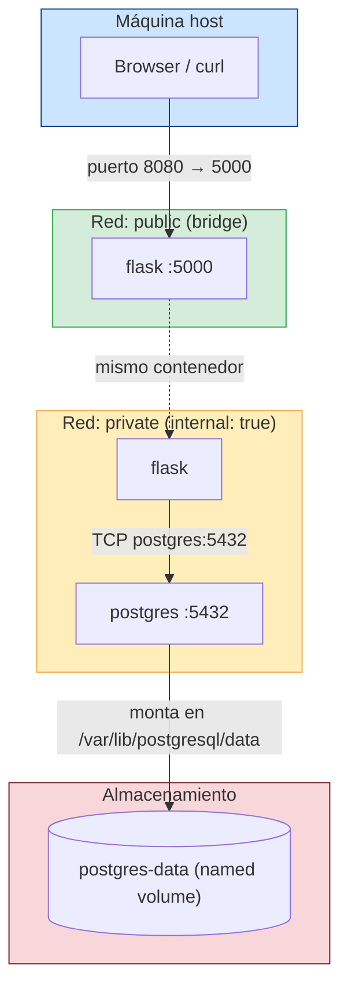

# Guía: Docker Compose + PostgreSQL con Flask (secretos, redes y volúmenes)

**Duración estimada:** 60–90 min  
**Nivel:** Intermedio  
**Prerrequisito:** Haber completado `laboratorio_docker_compose_00.md` (stack Flask + Postgres funcionando con `environment` y red por defecto)

---

## Objetivos de aprendizaje

- Corregir las dos debilidades identificadas en `laboratorio_docker_compose_00.md`
- Gestionar credenciales con `secrets` y `env_file` en vez de `environment`
- Aislar PostgreSQL con una red `internal: true`
- Persistir datos con un named volume
- **Verificar** cada corrección con comandos, no darla por hecha
- Conectar Flask a PostgreSQL con `psycopg` y connection pooling

---

## Qué corrige este laboratorio

En el lab anterior levantaste el stack y comprobaste tres problemas. Aquí los cierras:

| Problema del lab 00 | Cómo lo comprobaste | Corrección en este lab |
|---|---|---|
| Contraseña en `environment` de `compose.yaml` | `docker inspect ... --format '{{.Config.Env}}'` la mostraba | `secrets` + `POSTGRES_PASSWORD_FILE`, y `env_file` fuera de git |
| Red única con salida al host e internet | `docker network inspect` daba `internal=false` | Red `public` (solo Flask) + red `private` con `internal: true` |
| Datos perdidos tras `docker compose down` | La tabla `item` desaparecía | Named volume `postgres-data` |

Cada corrección tiene su paso de verificación. No des por bueno un cambio que no comprobaste.

---

## Requisitos del laboratorio

- Docker y Docker Compose instalados
- Directorio `flask-docker-app/` del lab anterior
- Editor de texto (vim, VS Code, etc.)

---

## Estructura del proyecto

Al finalizar este laboratorio tu directorio quedará así:

```
flask-docker-app/
├── app.py
├── requirements.txt
├── Dockerfile
├── .dockerignore      ← modificado
├── .gitignore         ← modificado
├── .env.dev           ← nuevo (ignorado por git)
├── pg_password.txt    ← nuevo (ignorado por git)
├── init.sql           ← nuevo
└── compose.yaml       ← modificado
```

---

## 1. Preparar el proyecto base

```bash
cd flask-docker-app
```

Si vienes del lab anterior, baja el stack y borra todo (incluido cualquier volumen suelto) para arrancar limpio:

```bash
docker compose down -v
```

---

## 2. Actualizar dependencias

`requirements.txt` (igual que en el lab anterior):

```
Flask==2.3.3
gunicorn==21.2.0
psycopg[binary,pool]==3.2.1
```

---

## 3. Crear archivos de configuración y secretos

### Archivo de variables de entorno (`.env.dev`)

```bash
vim .env.dev
```

```env
DB_PASSWORD=devops123
```

### Archivo de secreto para PostgreSQL (`pg_password.txt`)

```bash
printf 'devops123' > pg_password.txt
```

> **Usa `printf`, no `echo`.** `echo` agrega un salto de línea final y PostgreSQL lo incluiría en la contraseña, mientras que Flask leería `devops123` sin él. El resultado es un `password authentication failed` difícil de diagnosticar. Verifícalo:
>
> ```bash
> wc -c pg_password.txt    # debe dar 9, no 10
> ```

### Excluirlos de git y de la imagen

Los secretos no van al repositorio **ni** dentro de la imagen Docker:

```bash
printf '.env.dev\npg_password.txt\n' >> .gitignore
printf '.env.dev\npg_password.txt\n' >> .dockerignore
```

**Verificación:**

```bash
git check-ignore -v .env.dev pg_password.txt
```

Debe imprimir la regla de `.gitignore` que los captura. Si no imprime nada, git **sí** los versionaría: revisa el archivo.

> `.dockerignore` importa tanto como `.gitignore`: sin él, `COPY . .` en el `Dockerfile` metería la contraseña en una capa de la imagen, donde queda para siempre aunque borres el archivo después.

---

## 3.1 ¿Por qué dos archivos con la misma contraseña?

`pg_password.txt` y `.env.dev` contienen el mismo valor pero los lee un consumidor distinto:

| Archivo | Lo lee | Para qué |
|---|---|---|
| `pg_password.txt` | **PostgreSQL** vía `POSTGRES_PASSWORD_FILE` | Inicializar la contraseña del usuario en la DB |
| `.env.dev` | **Flask** vía `os.environ.get('DB_PASSWORD')` | Autenticarse contra la DB como cliente |

Son dos lados del mismo handshake: PostgreSQL establece su contraseña con el secreto; Flask usa esa misma contraseña para conectarse.

### Forma A — env_file + secret (la de este lab)

Dos archivos, cada servicio lee del suyo:

```
pg_password.txt  →  secret   →  postgres (POSTGRES_PASSWORD_FILE)
.env.dev         →  env_file →  flask   (DB_PASSWORD env var)
```

`compose.yaml`:
```yaml
services:
  flask:
    env_file:
      - .env.dev              # Flask lee DB_PASSWORD desde aquí

  postgres:
    environment:
      - POSTGRES_PASSWORD_FILE=/run/secrets/pg_password
    secrets:
      - pg_password           # Postgres lee la contraseña del archivo montado

secrets:
  pg_password:
    file: ./pg_password.txt
```

`app.py` lee la variable de entorno:
```python
db_password = os.environ.get('DB_PASSWORD')
```

**Cuándo usarla:** desarrollo, donde ya usas `env_file` para otras variables. Más simple de entender.

**Lo que NO resuelve:** `env_file` saca la contraseña de git, pero la sigue inyectando en el entorno del proceso Flask. Lo comprobarás en el paso 10.

---

### Forma B — solo secret (recomendada en producción)

Un solo archivo `pg_password.txt`, ambos servicios lo consumen como secreto:

```
pg_password.txt  →  secret  →  postgres (POSTGRES_PASSWORD_FILE)
                 →  secret  →  flask    (lee el archivo montado)
```

`compose.yaml`:
```yaml
services:
  flask:
    secrets:
      - pg_password           # secreto montado en /run/secrets/pg_password

  postgres:
    environment:
      - POSTGRES_PASSWORD_FILE=/run/secrets/pg_password
    secrets:
      - pg_password

secrets:
  pg_password:
    file: ./pg_password.txt
```

`app.py` lee directamente del archivo del secreto:
```python
db_password = open('/run/secrets/pg_password').read().strip()
```

**Cuándo usarla:** producción o cuando quieres una sola fuente de verdad. Elimina `.env.dev`, no hay riesgo de desincronización y la contraseña nunca aparece en el entorno del proceso.

---

### Comparativa

| Aspecto | Lab 00 (`environment`) | Forma A (env_file + secret) | Forma B (solo secret) |
|---|---|---|---|
| Archivos de credenciales | 0 (está en `compose.yaml`) | 2 (`pg_password.txt` + `.env.dev`) | 1 (`pg_password.txt`) |
| ¿Queda en git? | **Sí, para siempre** | No | No |
| Visible en `docker inspect` (postgres) | **Sí** | No | No |
| Visible en `env` del proceso Flask | **Sí** | **Sí** | No |
| Riesgo de desincronización | — | Sí | No |
| Recomendado para | Nada | Desarrollo | Producción |

> Este lab implementa la **Forma A** para mostrar `env_file` y `secrets` como mecanismos separados. El paso 12 te pide migrarla a la **Forma B**.

---

## 4. Crear el `init.sql`

Aunque el volumen ya persiste los datos, tener el esquema en un archivo lo hace reproducible: cualquiera puede recrear la DB desde cero con un comando.

```bash
vim init.sql
```

```sql
CREATE TABLE IF NOT EXISTS item (
  item_id serial PRIMARY KEY,
  priority varchar(256),
  task varchar(256)
);
```

> `IF NOT EXISTS` lo hace **idempotente**: puedes ejecutarlo varias veces sin error, aunque la tabla ya exista por el volumen.

---

## 5. Crear compose.yaml

```bash
vim compose.yaml
```

```yaml
services:
  flask:
    build: .
    image: flask-docker-app:2.0
    ports:
      - "8080:5000"
    env_file:
      - .env.dev
    environment:
      - APP_VERSION=2.0.0
      - DB_HOST=postgres
      - DB_DATABASE=mydb
      - DB_USER=myuser
    networks:
      - public
      - private
    depends_on:
      postgres:
        condition: service_healthy

  postgres:
    image: postgres:16.3
    restart: unless-stopped
    environment:
      - POSTGRES_USER=myuser
      - POSTGRES_DB=mydb
      - POSTGRES_PASSWORD_FILE=/run/secrets/pg_password
    secrets:
      - pg_password
    volumes:
      - postgres-data:/var/lib/postgresql/data
      - ./init.sql:/docker-entrypoint-initdb.d/init.sql:ro
    networks:
      - private
    healthcheck:
      test: ["CMD-SHELL", "pg_isready -U myuser -d mydb"]
      interval: 5s
      timeout: 5s
      retries: 5

secrets:
  pg_password:
    file: ./pg_password.txt

volumes:
  postgres-data:

networks:
  public:
  private:
    internal: true
```

**Puntos clave y qué cambió respecto al lab 00:**

| Configuración | Propósito | En el lab 00 |
|---|---|---|
| `secrets` + `POSTGRES_PASSWORD_FILE` | Postgres lee la contraseña de `/run/secrets/pg_password`, no de una env var | `POSTGRES_PASSWORD=devops123` en claro |
| `env_file: .env.dev` | `DB_PASSWORD` fuera de `compose.yaml` y fuera de git | `DB_PASSWORD=devops123` en el YAML |
| `networks: private` en postgres (y **sin** `ports`) | Postgres inalcanzable desde el host: no hay ruta, no solo "no hay mapeo" | Red `default`, con salida al host |
| `internal: true` | La red no tiene gateway al exterior; postgres tampoco sale a internet | — |
| `postgres-data` volume | Los datos sobreviven a `docker compose down` | Sin volumen: se perdían |
| `./init.sql:/docker-entrypoint-initdb.d/` | Postgres crea el esquema solo, en el primer arranque del volumen | Tabla creada a mano en `psql` |
| `image: flask-docker-app:2.0` | Etiqueta explícita para la imagen que construye `build` | Solo `build: .` |

> **`postgres` NO lleva `ports`.** Un `ports: "5432:5432"` sobre un servicio que solo está en una red `internal: true` es una contradicción: pide exponer al host justo lo que la red aísla. Si necesitas `psql` contra esa DB, usa `docker compose exec` (paso 9) — eso entra por el propio contenedor, no por el host.

> **`/docker-entrypoint-initdb.d/` solo corre una vez**, en el primer arranque con el directorio de datos vacío. Con el volumen ya poblado, Postgres lo ignora. Eso es lo correcto: el init no debe pisar datos existentes. Para cambios de esquema posteriores, aplica el SQL a mano o usa migraciones.

---

## 6. Conceptos: Redes en Docker Compose

### ¿Qué es una red en Docker Compose?

Por defecto, Compose crea una sola red compartida donde todos los servicios se comunican entre sí — y esa red tiene salida al host y a internet. Para este stack definimos **dos redes con responsabilidades distintas**:

| Red | `internal` | Quién pertenece | Propósito |
|---|---|---|---|
| `public` | `false` (default) | `flask` | Permite que el host acceda al contenedor vía port mapping |
| `private` | `true` | `flask`, `postgres` | Comunicación interna entre servicios; sin salida a internet ni al host |

### Red pública (`public`)

- Es una red bridge normal de Docker.
- `flask` está conectado a ella y tiene el port mapping `8080:5000`, lo que permite que el navegador o `curl` desde el host lleguen a la app.
- Si `postgres` estuviera aquí, bastaría un `ports` para exponer la DB al host.

### Red privada (`private` con `internal: true`)

- `internal: true` le dice a Docker que **no cree una ruta de salida** hacia el exterior (ni al host, ni a internet).
- Solo los contenedores conectados a esta red hablan entre sí.
- `postgres` vive únicamente aquí: es invisible desde fuera del stack.
- `flask` está en **ambas** redes: recibe tráfico del host por `public` y habla con la DB por `private`. Es el único puente, y eso es deliberado.

### Diagrama de arquitectura



**Flujo de una petición `POST /items`:**
1. `curl` en el host golpea `localhost:8080` → Docker redirige al puerto `5000` del contenedor `flask` (red `public`).
2. `flask` procesa la petición y necesita guardar en DB → resuelve el hostname `postgres` dentro de la red `private`.
3. `postgres` recibe la query y escribe en el volumen `postgres-data`.
4. El host **nunca** puede tocar directamente el puerto 5432 de `postgres`: no hay ruta (`internal: true`).

---

## 7. Conceptos: Volúmenes en Docker Compose

### ¿Por qué se necesitan volúmenes?

Los contenedores son **efímeros**: cuando se eliminan, todo lo que escribieron en su filesystem interno desaparece. Lo comprobaste en el lab 00 — la tabla `item` se perdía tras cada `down`.

Un **volumen** es un directorio gestionado por Docker que existe **fuera del ciclo de vida del contenedor**. Los datos persisten aunque el contenedor se destruya y se recree.

### Tipos de montaje en Docker

| Tipo | Sintaxis en compose | Dónde vive | Uso típico |
|---|---|---|---|
| **Named volume** | `postgres-data:/var/lib/postgresql/data` | Gestionado por Docker (`/var/lib/docker/volumes/`) | Persistencia de DB, datos de producción |
| **Bind mount** | `./init.sql:/docker-entrypoint-initdb.d/init.sql:ro` | Directorio real del host | Desarrollo, inyectar archivos de config |
| **tmpfs** | `tmpfs: /tmp` | RAM del host | Datos temporales sensibles, caché |

En este stack usamos los dos primeros: un **named volume** para los datos y un **bind mount de solo lectura** (`:ro`) para `init.sql`.

> El sufijo `:ro` monta el archivo como read-only. Es buena práctica en todo bind mount que el contenedor solo deba leer: evita que un proceso dentro del contenedor modifique un archivo de tu máquina.

### Comportamiento de `docker compose down`

```bash
docker compose down        # elimina contenedores — el volumen postgres-data SOBREVIVE
docker compose down -v     # elimina contenedores Y el volumen — datos PERDIDOS
docker compose up -d       # recrea contenedores — postgres-data se monta con los datos intactos
```

### Comandos útiles para volúmenes

```bash
docker volume ls
docker volume inspect flask-docker-app_postgres-data
docker volume prune
```

> El nombre del volumen en el host sigue el patrón `<directorio_proyecto>_<nombre_volumen>`, por ejemplo `flask-docker-app_postgres-data`.

---

## 8. Actualizar app.py

```bash
vim app.py
```

```python
from flask import Flask, jsonify, render_template_string, request
import os
from psycopg_pool import ConnectionPool


def db_connect():
    url = (
        f"host={os.environ.get('DB_HOST')} "
        f"dbname={os.environ.get('DB_DATABASE')} "
        f"user={os.environ.get('DB_USER')} "
        f"password={os.environ.get('DB_PASSWORD')}"
    )
    pool = ConnectionPool(url)
    pool.wait()
    return pool


pool = db_connect()

app = Flask(__name__)


@app.route('/')
def home():
    html = '''
    <!DOCTYPE html>
    <html>
    <head>
        <title>Flask Docker App</title>
        <style>
            body { font-family: Arial, sans-serif; margin: 50px; }
            .container { max-width: 600px; margin: 0 auto; }
            h1 { color: #2196F3; }
        </style>
    </head>
    <body>
        <div class="container">
            <h1>Flask + PostgreSQL</h1>
            <p>Stack Flask + PostgreSQL corriendo con Docker Compose.</p>
            <ul>
                <li><a href="/api/health">Estado de la API</a></li>
                <li><a href="/items">Listar items</a></li>
            </ul>
        </div>
    </body>
    </html>
    '''
    return render_template_string(html)


@app.route('/api/health')
def health():
    return jsonify({"status": "healthy", "version": os.environ.get("APP_VERSION")})


def save_item(priority, task):
    with pool.connection() as conn:
        with conn.cursor() as cur:
            cur.execute(
                'INSERT INTO item (priority, task) VALUES (%s, %s)',
                (priority, task)
            )
            conn.commit()


def get_items():
    with pool.connection() as conn:
        with conn.cursor() as cur:
            cur.execute('SELECT item_id, priority, task FROM item')
            return [{'id': r[0], 'priority': r[1], 'task': r[2]} for r in cur]


@app.route('/items', methods=['GET', 'POST'])
def items():
    if request.method == 'POST':
        body = request.get_json()
        save_item(body['priority'], body['task'])
        return {'message': 'item saved!'}, 201
    return get_items(), 200


if __name__ == '__main__':
    app.run(host='0.0.0.0', port=5000, debug=True)
```

> El `INSERT` usa parámetros (`%s`) y no interpolación de strings. Eso es lo que evita inyección SQL: `psycopg` escapa los valores, nunca los concatena en la query.

---

## 9. Levantar el stack

```bash
docker compose up --build -d
docker compose ps
```

Ambos servicios deben estar `running`; `postgres` además `healthy`.

La tabla ya existe: `init.sql` corrió en el primer arranque. Compruébalo sin abrir una sesión interactiva:

```bash
docker compose exec postgres psql -U myuser -d mydb -c '\dt'
```

Debes ver la tabla `item`. Si no aparece, mira el arranque de Postgres:

```bash
docker compose logs postgres | grep -i 'init'
```

---

## 10. Verificar las correcciones

Este es el paso que cierra el lab 00. Cada comando responde a un riesgo concreto.

### 10.1 La contraseña ya no está en `docker inspect`

En el lab 00 este comando mostraba `POSTGRES_PASSWORD=devops123`:

```bash
docker inspect flask-docker-app-postgres-1 --format '{{.Config.Env}}'
```

Ahora solo aparece `POSTGRES_PASSWORD_FILE=/run/secrets/pg_password` — una ruta, no un valor.

El secreto está montado como archivo dentro del contenedor, no en su entorno:

```bash
docker compose exec postgres cat /run/secrets/pg_password
docker compose exec postgres env | grep -c POSTGRES_PASSWORD=   # debe dar 0
```

### 10.2 La contraseña no está en git

```bash
git check-ignore -v .env.dev pg_password.txt
git status --short            # ninguno de los dos debe aparecer
grep -r devops123 compose.yaml || echo "OK: compose.yaml sin credenciales"
```

### 10.3 `env_file` NO oculta la contraseña del proceso (límite de la Forma A)

```bash
docker compose exec flask env | grep DB_PASSWORD
```

**Sí la muestra.** `env_file` resolvió el problema de git, no el del entorno del proceso: cualquier volcado de `os.environ` en un log de error la filtraría. Esto es exactamente lo que resuelve la **Forma B** (paso 12).

### 10.4 La red privada está aislada

```bash
docker network inspect flask-docker-app_private --format 'internal={{.Internal}}'
```

Debe dar `internal=true` (en el lab 00 daba `false`).

Postgres ya no tiene salida a internet:

```bash
docker compose exec postgres sh -c 'getent hosts deb.debian.org || echo "OK: sin salida a internet"'
```

### 10.5 Postgres es inalcanzable desde el host

```bash
docker compose port postgres 5432 || echo "OK: sin port mapping"
nc -vz localhost 5432 || echo "OK: puerto 5432 cerrado en el host"
```

Flask, en cambio, sí llega — está en la red `private`:

```bash
docker compose exec flask sh -c 'getent hosts postgres'
```

### Resumen de la verificación

| Comprobación | Lab 00 | Este lab |
|---|---|---|
| `docker inspect` postgres muestra la contraseña | Sí | No |
| Credenciales en `compose.yaml` versionado | Sí | No |
| `env` de Flask muestra `DB_PASSWORD` | Sí | Sí (lo cierra la Forma B) |
| Red `internal` | `false` | `true` |
| Postgres alcanzable desde el host | Posible con un `ports` | Imposible |
| Postgres con salida a internet | Sí | No |

---

## 11. Probar los endpoints

```bash
curl localhost:8080/api/health

curl -H "Content-Type: application/json" \
     -d '{"priority":"high","task":"doctor appointment"}' \
     localhost:8080/items

curl -H "Content-Type: application/json" \
     -d '{"priority":"low","task":"buy dinner"}' \
     localhost:8080/items

curl localhost:8080/items
```

Respuesta esperada:

```json
[
  {"id": 1, "priority": "high", "task": "doctor appointment"},
  {"id": 2, "priority": "low",  "task": "buy dinner"}
]
```

### Verificar la persistencia

Repite el experimento del lab 00, donde esto devolvía un error 500:

```bash
docker compose down
docker compose up -d
curl localhost:8080/items    # los items siguen ahí
```

`docker compose down` elimina los contenedores pero **no** el volumen `postgres-data`. Para borrar los datos hay que pedirlo explícitamente con `docker compose down -v`.

---

## 12. Ejercicio: migrar a la Forma B

La Forma A deja `DB_PASSWORD` en el entorno del proceso Flask (lo viste en 10.3). Ciérralo:

1. Elimina `.env.dev` y su línea en `env_file`.
2. Agrega `secrets: [pg_password]` al servicio `flask`.
3. En `app.py`, reemplaza la lectura de la contraseña:

```python
def read_secret(path, fallback_env):
    if os.path.exists(path):
        return open(path).read().strip()
    return os.environ.get(fallback_env)


db_password = read_secret('/run/secrets/pg_password', 'DB_PASSWORD')
```

4. Levanta de nuevo y verifica que ya no aparece en el entorno:

```bash
docker compose up --build -d
docker compose exec flask env | grep DB_PASSWORD || echo "OK: ya no está en el entorno"
curl localhost:8080/items
```

> El fallback a la env var mantiene la app funcionando fuera de Compose (tests locales, otro orquestador) sin hardcodear rutas de secretos.

---

## 13. Comandos útiles de Docker Compose

```bash
docker compose up --build -d          # levantar reconstruyendo imágenes
docker compose ps                     # estado de servicios
docker compose logs -f flask          # logs en vivo de un servicio
docker compose exec postgres psql -U myuser -d mydb   # shell SQL
docker compose config                 # YAML final resuelto (valida la sintaxis)
docker compose down                   # detener (conserva volúmenes)
docker compose down -v                # detener y borrar volúmenes
docker compose build flask            # reconstruir solo una imagen
```

> `docker compose config` es la forma rápida de validar el YAML antes de levantar. Muestra el archivo con variables resueltas y falla si hay un error de sintaxis — sin arrancar nada.

---

## Checklist de éxito

- [ ] `.env.dev` y `pg_password.txt` creados y capturados por `.gitignore` **y** `.dockerignore`
- [ ] `pg_password.txt` sin salto de línea final (`wc -c` = 9)
- [ ] `compose.yaml` con `secrets`, `volumes` y dos `networks`
- [ ] `postgres` **sin** `ports` y solo en la red `private`
- [ ] Stack levantado; ambos contenedores `running`, postgres `healthy`
- [ ] Tabla `item` creada automáticamente por `init.sql`
- [ ] `POST /items` devuelve `201` y `GET /items` lista los items
- [ ] `docker inspect` postgres **no** muestra la contraseña (10.1)
- [ ] `docker network inspect` da `internal=true` (10.4)
- [ ] Postgres sin salida a internet y sin port mapping (10.4, 10.5)
- [ ] Datos persisten tras `docker compose down` + `up -d`
- [ ] (Opcional) Migrado a la Forma B: `DB_PASSWORD` ya no está en el entorno de Flask

---

## Consideraciones de seguridad

- Nunca pongas contraseñas en `environment`: quedan en `docker inspect`, en el entorno del proceso y, si versionas el YAML, en git para siempre
- `env_file` saca la credencial de git, pero **no** del entorno del proceso; solo `secrets` logra ambas cosas
- Un secreto en `.gitignore` también debe estar en `.dockerignore`, o acaba horneado en una capa de la imagen
- La red `private` con `internal: true` bloquea el acceso externo a PostgreSQL; un `ports` sobre ese servicio anularía el aislamiento
- Monta en `:ro` todo bind mount que el contenedor solo deba leer
- Usa parámetros (`%s`) en las queries, nunca concatenación de strings
- `devops123` es una contraseña de laboratorio. En cualquier entorno real, genera una aleatoria (`openssl rand -base64 32 > pg_password.txt`) y gestiona los secretos con un gestor dedicado (Vault, AWS Secrets Manager, Docker Swarm secrets)

---

## Troubleshooting

### `bind source path does not exist: .../pg_password.txt`

```
Error response from daemon: invalid mount config for type "bind":
bind source path does not exist: .../pg_password.txt
```

**Causa:** `pg_password.txt` está en `.gitignore` y no se versiona. Hay que crearlo manualmente en cada máquina o entorno nuevo.

**Solución:**
```bash
printf 'devops123' > pg_password.txt
docker compose up -d
```

> Este error es el precio correcto de no versionar secretos. Documenta en el README del proyecto qué archivos hay que crear a mano; un `compose.yaml` que arranca sin fricción en cualquier clon es un `compose.yaml` con credenciales dentro.

---

### `password authentication failed for user "myuser"`

**Causa más común:** `pg_password.txt` se creó con `echo`, que agrega `\n`. Postgres guardó la contraseña con el salto; Flask envía `devops123` sin él.

```bash
wc -c pg_password.txt    # si da 10 en vez de 9, ese es el problema
```

**Solución:** recrear el archivo **y** el volumen (la contraseña ya quedó grabada en el initdb):

```bash
printf 'devops123' > pg_password.txt
docker compose down -v
docker compose up -d
```

**Otra causa:** `.env.dev` y `pg_password.txt` quedaron desincronizados. Es el riesgo propio de la Forma A; la Forma B lo elimina.

---

### `port is already allocated (8080)`

```
Bind for 0.0.0.0:8080 failed: port is already allocated
```

**Identificar qué ocupa el puerto:**
```bash
lsof -i :8080
docker ps -a
```

**Opción A — eliminar el contenedor anterior:**
```bash
docker rm -f <nombre>
docker compose up -d
```

**Opción B — cambiar el puerto en `compose.yaml`:**
```yaml
ports:
  - "8081:5000"
```
```bash
docker compose up -d
curl localhost:8081/api/health
```

---

### `psycopg.OperationalError: connection refused`

**Causa:** Flask intentó conectarse antes de que Postgres estuviera listo, o no comparte red con él.

```bash
docker compose ps                      # postgres debe estar healthy
docker compose logs postgres
docker compose exec flask getent hosts postgres   # debe resolver
```

Si `getent` no resuelve, a `flask` le falta la red `private` en `compose.yaml`.

```bash
docker compose restart flask
```

---

### `relation "item" does not exist`

**Causa:** `init.sql` no corrió. Solo se ejecuta en el **primer** arranque con el volumen vacío; si el volumen ya existía de antes, Postgres lo ignora.

**Solución A — aplicar el SQL al volumen actual (conserva datos):**
```bash
docker compose exec -T postgres psql -U myuser -d mydb < init.sql
```

| Flag | Por qué |
|---|---|
| `-T` | Desactiva la pseudo-TTY; necesario para pasar un archivo por `stdin` |
| `< init.sql` | `psql` lee el SQL del archivo en lugar de la sesión interactiva |

**Solución B — recrear el volumen desde cero (borra datos):**
```bash
docker compose down -v
docker compose up -d
```

---

### Los datos no persisten tras `docker compose down`

**Causa:** se usó `docker compose down -v`, que elimina los volúmenes junto con los contenedores.

```bash
docker volume ls | grep postgres      # ¿existe flask-docker-app_postgres-data?
docker compose down                   # sin -v: conserva los datos
docker compose up -d
```

---

### Ver logs por servicio

```bash
docker compose logs -f                  # todos, en tiempo real
docker compose logs flask               # historial de un servicio
docker compose logs -f --tail=100 flask # últimas 100 líneas y seguir
docker compose logs --since=5m flask    # últimos 5 minutos
docker compose logs -t postgres         # con timestamps
```

---

¡Felicidades! Cerraste las tres debilidades del lab 00 —credenciales, aislamiento de red y persistencia— y las **verificaste** una por una en vez de asumirlas.

---

## Siguiente paso

Continúa con `laboratorio_docker_compose_02.md` para endurecer el contenedor y separar dev de prod:

| Capa | Qué resuelve |
|---|---|
| `user`, `read_only`, `cap_drop`, `no-new-privileges` | Un exploit en la app no tiene root, no escribe en la imagen, no escala |
| `deploy.resources.limits` + `logging` | Un servicio con fuga no tumba el host ni llena el disco |
| `compose.override.yaml` + `compose.prod.yaml` | Dev con `ports` y hot reload; prod con Forma B y puerto en `127.0.0.1` |
