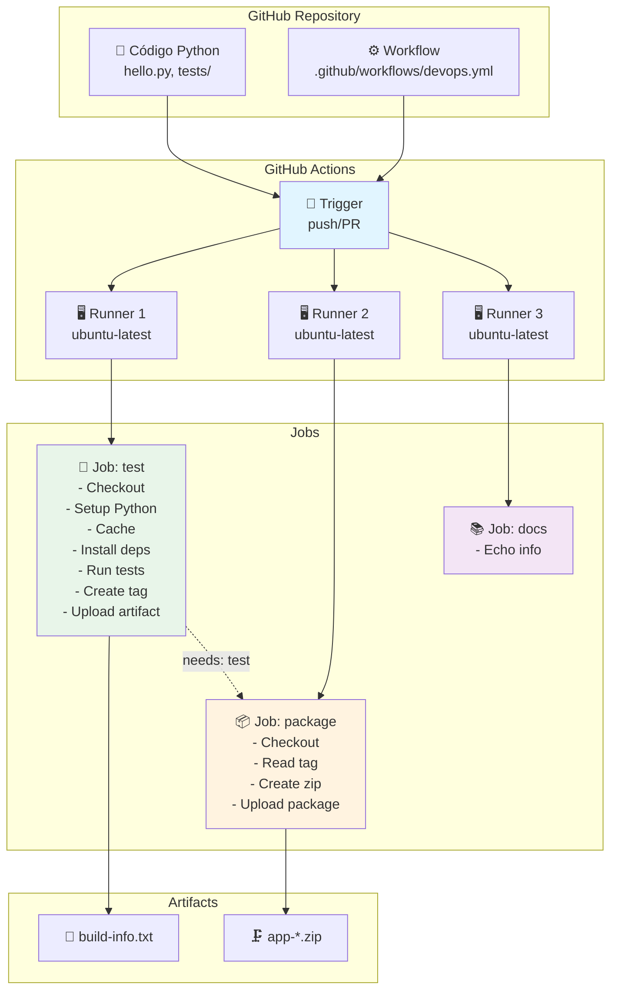
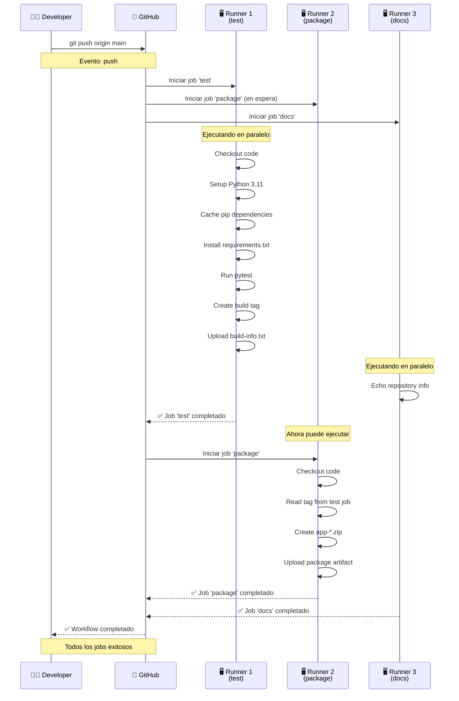

# Laboratorio: GitHub Actions - CI/CD con Python

**Duración estimada:** 150–180 min  
**Nivel:** Intermedio  
**Contexto:** En este laboratorio aprenderás a implementar CI/CD con GitHub Actions, desde los conceptos fundamentales hasta un pipeline completo que ejecuta tests, empaqueta la aplicación, despliega a GitHub Pages con aprobación manual y publica releases versionados.

---

## Objetivos de aprendizaje

- Entender la arquitectura y componentes de GitHub Actions (Workflows, Jobs, Steps, Actions, Runners)
- Crear workflows de CI/CD para aplicaciones Python
- Implementar jobs paralelos y secuenciales
- Gestionar artefactos y outputs entre jobs
- Configurar cache para optimizar tiempos de ejecución
- Aplicar buenas prácticas de seguridad y organización
- Desplegar a un entorno real (GitHub Pages) con gate de aprobación manual
- Publicar releases versionados con SemVer
- Hacer observable el pipeline (summaries, badges, reportes de tests)
- Aplicar un quality gate de cobertura mínima (80%) que bloquee el despliegue
- Relacionar el pipeline con las métricas DORA

---

## Requisitos

- Cuenta de GitHub con repositorio
- Conocimientos básicos de Git y GitHub
- Familiaridad con Python y pytest
- Editor de texto o IDE configurado

---

## Estructura del proyecto

```
github_actions_demo/
├── .github/
│   └── workflows/
│       ├── devops.yml          # Workflow principal de CI/CD
│       └── release.yml         # Workflow de releases (tags v*)
├── site/
│   └── index.html              # Página desplegada en GitHub Pages
├── hello.py                    # Aplicación Python simple
├── tests/
│   └── test_hello.py          # Tests unitarios
├── requirements.txt            # Dependencias Python
├── .coveragerc                 # Umbral de cobertura y exclusiones
└── README.md                   # Documentación del proyecto
```

---

## Código fuente del proyecto

### `hello.py`

```python
def greet(name: str) -> str:
    return f"Hello, {name}!"


def add(a: int, b: int) -> int:
    return a + b


def is_even(n: int) -> bool:
    return n % 2 == 0


if __name__ == "__main__":
    print(greet("GitHub Actions"))
    print(f"2 + 3 = {add(2, 3)}")
    print(f"4 is even: {is_even(4)}")
```

### `tests/test_hello.py`

```python
from hello import greet, add, is_even


def test_greet():
    assert greet("World") == "Hello, World!"
    assert greet("GitHub Actions") == "Hello, GitHub Actions!"


def test_add():
    assert add(2, 3) == 5
    assert add(-1, 1) == 0
    assert add(0, 0) == 0


def test_is_even():
    assert is_even(4) is True
    assert is_even(3) is False
    assert is_even(0) is True
```

### `requirements.txt`

```
pytest==7.4.3
pytest-cov==4.1.0
```

---

## Parte 1: Conceptos Fundamentales de GitHub Actions

### 1.1 ¿Qué es GitHub Actions?

**GitHub Actions** es una plataforma de CI/CD (Integración Continua/Despliegue Continuo) integrada en GitHub que permite automatizar tareas de desarrollo, testing, building y deployment directamente desde tu repositorio.

**Ventajas principales:**
- ✅ **Integración nativa**: No requiere servicios externos
- ✅ **Marketplace**: Miles de acciones pre-construidas
- ✅ **Gratuito**: 2000 minutos/mes para repositorios públicos
- ✅ **Multi-plataforma**: Windows, macOS, Linux
- ✅ **Matrices**: Ejecutar en múltiples versiones simultáneamente

### 1.2 Componentes de GitHub Actions

#### **Workflow (Flujo de trabajo)**
Un **workflow** es un proceso automatizado definido en un archivo YAML que se ejecuta cuando se dispara por eventos específicos (push, pull request, etc.).

```yaml
# Ejemplo básico de workflow
name: Mi Workflow
on: [push, pull_request]
jobs:
  test:
    runs-on: ubuntu-latest
    steps:
      - uses: actions/checkout@v4
```

#### **Job (Trabajo)**
Un **job** es un conjunto de pasos que se ejecutan en el mismo runner. Los jobs pueden ejecutarse en paralelo o secuencialmente.

```yaml
jobs:
  test:        # Job 1: Ejecuta tests
    runs-on: ubuntu-latest
    steps: [...]
  
  build:       # Job 2: Construye la aplicación
    needs: test  # Espera a que termine 'test'
    runs-on: ubuntu-latest
    steps: [...]
```

#### **Step (Paso)**
Un **step** es una tarea individual dentro de un job. Puede ser una acción (action) o un comando de shell.

```yaml
steps:
  - name: Checkout code
    uses: actions/checkout@v4    # Action pre-construida
  
  - name: Run tests
    run: pytest                 # Comando de shell
```

#### **Action (Acción)**
Una **action** es una unidad reutilizable de código que realiza una tarea específica. Pueden ser oficiales de GitHub o de la comunidad.

```yaml
- uses: actions/checkout@v4      # Action oficial
- uses: actions/setup-python@v5  # Action oficial
- uses: user/custom-action@v1    # Action de la comunidad
```

#### **Runner (Ejecutor)**
Un **runner** es un servidor que ejecuta los workflows. Pueden ser:
- **GitHub-hosted**: Servidores gestionados por GitHub (ubuntu-latest, windows-latest, macos-latest)
- **Self-hosted**: Servidores propios que registras en GitHub

---

## Parte 2: Análisis del Workflow

### 2.1 Estructura del archivo `devops.yml`

```yaml
name: CI básico Python + Bash
run-name: "CI disparado por ${{ github.actor }}"

on:
  push:
    branches: [ main ]
  pull_request:
    types:
      - opened
      - synchronize

jobs:       # ← todos los jobs van anidados aquí
  test:
    ...
  package:
    ...
  docs:
    ...
```

> ⚠️ **Error común:** Los jobs deben estar anidados bajo la clave `jobs:`. Si escribes `test:` al mismo nivel que `on:`, el workflow es inválido y GitHub lo rechazará.

**Explicación:**
- `name`: Nombre descriptivo del workflow
- `run-name`: Nombre dinámico para cada ejecución (incluye el usuario que lo disparó)
- `on`: Eventos que disparan el workflow
  - `push` en rama `main`: Se ejecuta al hacer push a main
  - `pull_request` con `types: [opened, synchronize]`: Se ejecuta al abrir el PR y en cada push posterior — omitir `types` dispara en todos los eventos de PR (opened, closed, reopened, etc.)

### 2.2 Job 1: Test (Validación)

Un job tiene esta anatomía — `runs-on`, `outputs` y `steps` son hermanos al mismo nivel:

```yaml
test:
  runs-on: ubuntu-latest        # ← nivel 1: dónde corre

  outputs:                      # ← nivel 1: qué expone al exterior
    build_tag: ${{ steps.meta.outputs.tag }}

  steps:                        # ← nivel 1: qué hace (lista de pasos)
    - name: ...
    - name: ...
```

> ⚠️ `outputs:` y `steps:` son hermanos — `steps:` **nunca** va dentro de `outputs:`.

Job completo:

```yaml
test:
  runs-on: ubuntu-latest

  outputs:
    build_tag: ${{ steps.meta.outputs.tag }}

  steps:
    # STEP 1: Checkout
    - name: Checkout
      uses: actions/checkout@v4

    # STEP 2: Setup Python
    - name: Setup Python
      uses: actions/setup-python@v5
      with:
        python-version: "3.11"

    # STEP 3: Cache
    - name: Cache pip
      uses: actions/cache@v4
      with:
        path: ~/.cache/pip
        key: pip-${{ runner.os }}-${{ hashFiles('requirements.txt') }}
        restore-keys: pip-${{ runner.os }}-

    # STEP 4: Install dependencies
    - name: Install deps
      run: |
        python -m pip install --upgrade pip
        pip install -r requirements.txt

    # STEP 5: Run tests
    - name: Run tests
      run: |
        export PYTHONPATH="${PYTHONPATH}:$(pwd)"
        pytest -q

    # STEP 6: Create build tag  ← el step que alimenta outputs.build_tag
    - name: Compute build tag
      id: meta
      run: |
        TS=$(date +%Y%m%d-%H%M%S)
        echo "tag=${TS}-${GITHUB_SHA::7}" >> "$GITHUB_OUTPUT"

    # STEP 7: Save artifact
    - name: Save artifact (sample log)
      run: |
        echo "Build tag: ${{ steps.meta.outputs.tag }}" > build-info.txt
    - name: Upload build info artifact
      uses: actions/upload-artifact@v4
      with:
        name: build-info
        path: build-info.txt
```

**Conceptos clave:**

#### **Checkout Action**
```yaml
- uses: actions/checkout@v4
```
- Descarga el código del repositorio al runner
- Es el primer paso en casi todos los workflows
- Versión `@v4` es la más reciente y estable

#### **Setup Python Action**
```yaml
- uses: actions/setup-python@v5
  with:
    python-version: "3.11"
```
- Instala una versión específica de Python
- Configura automáticamente el PATH
- Soporta múltiples versiones simultáneas

#### **Cache Action**
```yaml
- uses: actions/cache@v4
  with:
    path: ~/.cache/pip
    key: pip-${{ runner.os }}-${{ hashFiles('requirements.txt') }}
    restore-keys: pip-${{ runner.os }}-
```
- **¿Por qué usar cache?** Acelera builds subsecuentes guardando dependencias
- **`path`**: Directorio a cachear
- **`key`**: Clave única basada en OS y hash del archivo requirements.txt
- **`restore-keys`**: Claves de respaldo si no encuentra el cache exacto

#### **Variables de entorno y outputs**
```yaml
- name: Compute build tag
  id: meta                    # ID del step para referenciarlo
  run: |
    TS=$(date +%Y%m%d-%H%M%S)
    echo "tag=${TS}-${GITHUB_SHA::7}" >> "$GITHUB_OUTPUT"
```
- **`id`**: Permite referenciar el step desde otros steps
- **`$GITHUB_OUTPUT`**: Archivo especial para outputs del step
- **`$GITHUB_SHA`**: Hash del commit actual (variable predefinida)

#### **Upload Artifact Action**
```yaml
- uses: actions/upload-artifact@v4
  with:
    name: build-info
    path: build-info.txt
```
- Guarda archivos para usar en otros jobs o descargar
- Los artefactos persisten por 90 días
- Se pueden descargar desde la interfaz de GitHub

### 2.3 Job 2: Package (Empaquetado)

```yaml
package:
  needs: test              # Dependencia: espera a que termine 'test'
  runs-on: ubuntu-latest
  steps:
    - name: Checkout
      uses: actions/checkout@v4

    - name: Read tag from previous job
      run: echo "TAG = ${{ needs.test.outputs.build_tag }}"
      env:
        TAG: ${{ needs.test.outputs.build_tag }}

    - name: Create zip
      run: |
        mkdir -p dist
        cp hello.py dist/
        zip -r "app-${{ needs.test.outputs.build_tag }}.zip" dist
        mv "app-${{ needs.test.outputs.build_tag }}.zip" dist/

    - name: Upload package
      uses: actions/upload-artifact@v4
      with:
        name: app-zip
        path: dist/*.zip
```

**Conceptos clave:**

#### **Dependencias entre jobs**
```yaml
package:
  needs: test
```
- **`needs`**: Define dependencias entre jobs
- El job `package` solo se ejecuta si `test` termina exitosamente
- Permite crear pipelines secuenciales

#### **Acceso a outputs de otros jobs**
```yaml
${{ needs.test.outputs.build_tag }}
```
- **`needs.<job>.outputs.<name>`**: Accede a outputs de jobs anteriores
- Requiere que el job anterior defina outputs (ver sección 3.1)

> ⚠️ **Error común:** Si el job `test` no declara el bloque `outputs:`, el valor de `needs.test.outputs.build_tag` siempre será vacío — sin error visible, simplemente el ZIP se llama `app-.zip`. Ver sección 3.1 para la declaración correcta.

### 2.4 Job 3: Docs (Documentación)

```yaml
docs:
  runs-on: ubuntu-latest
  needs: [test, package]
  steps:
    - name: Echo info (Bash)
      run: |
        echo "Repo: $GITHUB_REPOSITORY"
        echo "Evento: $GITHUB_EVENT_NAME"
        echo "Runner: $RUNNER_OS"
```

**Variables predefinidas de GitHub:**
- **`$GITHUB_REPOSITORY`**: Nombre del repositorio (usuario/repo)
- **`$GITHUB_EVENT_NAME`**: Tipo de evento (push, pull_request, etc.)
- **`$RUNNER_OS`**: Sistema operativo del runner (Linux, Windows, macOS)

---

## Parte 3: Configuración Avanzada

### 3.1 Outputs de Jobs

Para que un job pueda pasar datos a otros jobs hay **dos requisitos que deben cumplirse juntos**:

1. El step escribe el valor en `$GITHUB_OUTPUT` usando `id:`
2. El job declara `outputs:` que apunta a ese step

Si falta cualquiera de los dos, el valor llega vacío al job siguiente sin ningún error visible.

**Cómo se conectan:**

```
step (id: meta)                    job (outputs:)             job siguiente
────────────────                   ──────────────             ─────────────
echo "tag=abc" >>                  outputs:                   ${{ needs.test
  $GITHUB_OUTPUT        ────►        build_tag:      ────►         .outputs
                                       ${{ steps              .build_tag }}
                                         .meta
                                         .outputs.tag }}
```

**Código completo:**

```yaml
jobs:
  test:
    runs-on: ubuntu-latest

    outputs:                              # paso 2: el job expone el valor
      build_tag: ${{ steps.meta.outputs.tag }}

    steps:                                # outputs y steps son HERMANOS
      - name: Compute build tag
        id: meta                          # paso 1: el step tiene id
        run: |
          TS=$(date +%Y%m%d-%H%M%S)
          echo "tag=${TS}-${GITHUB_SHA::7}" >> "$GITHUB_OUTPUT"
```

> ⚠️ `steps:` no va dentro de `outputs:`. El bloque `outputs:` solo contiene pares `nombre: ${{ steps.<id>.outputs.<key> }}` — nada más.

### 3.2 Matrices (Matrix Strategy)

Ejecutar el mismo job en múltiples configuraciones:

```yaml
jobs:
  test:
    runs-on: ubuntu-latest
    strategy:
      matrix:
        python-version: ["3.9", "3.10", "3.11"]
        os: [ubuntu-latest, windows-latest, macos-latest]
    steps:
      - uses: actions/checkout@v4
      - uses: actions/setup-python@v5
        with:
          python-version: ${{ matrix.python-version }}
      - name: Test on ${{ matrix.os }} with Python ${{ matrix.python-version }}
        run: pytest
```

### 3.3 Condiciones (if)

Ejecutar steps o jobs condicionalmente:

```yaml
jobs:
  deploy:
    needs: docs
    if: github.ref == 'refs/heads/main'  # Solo en rama main
    runs-on: ubuntu-latest
    steps:
      - name: Deploy to production
        run: echo "Deploying..."
        # if: github.event_name == 'push'   # Solo en push, no en PR
        #run: echo "Deploying..."
```

### 3.4 Secrets y Variables de Entorno

#### **Secrets (Datos sensibles)**
```yaml
steps:
  - name: Deploy
    env:
      API_KEY: ${{ secrets.API_KEY }}
      DATABASE_URL: ${{ secrets.DATABASE_URL }}
    run: |
      echo "Deploying with API key: ${API_KEY:0:8}..."
```

#### **Variables de repositorio (No sensibles)**
```yaml
steps:
  - name: Build
    env:
      APP_VERSION: ${{ vars.APP_VERSION }}
      ENVIRONMENT: ${{ vars.ENVIRONMENT }}
    run: |
      echo "Building version $APP_VERSION for $ENVIRONMENT"
```

---

## Parte 4: Flujo de Ejecución

### 4.1 Diagrama de Arquitectura



### 4.2 Secuencia de Ejecución



---

## Parte 5: Pruebas y Validación

### 5.1 Ejecutar el Workflow

1. **Hacer un commit y push:**
```bash
git add .
git commit -m "feat: add GitHub Actions workflow"
git push origin main
```

2. **Verificar en GitHub:**
   - Ve a tu repositorio en GitHub
   - Haz clic en la pestaña "Actions"
   - Verás el workflow ejecutándose

### 5.2 Orden de ejecución esperado

```
1. test (inmediato)                    ✅
2. docs (inmediato, paralelo con test) ✅
3. package (espera a test)             ✅
```

### 5.3 Interpretar los Resultados

#### **Estado de los Jobs:**
- ✅ **Verde**: Job exitoso
- ❌ **Rojo**: Job falló
- 🟡 **Amarillo**: Job en progreso
- ⚪ **Gris**: Job cancelado o en espera

#### **Logs detallados:**
```
✓ Checkout code (2s)
✓ Setup Python (15s)
✓ Cache pip (1s)
✓ Install deps (45s)
✓ Run tests (3s)
✓ Compute build tag (1s)
✓ Save artifact (1s)
✓ Upload build info artifact (2s)
```

### 5.4 Descargar Artefactos

1. Ve a la ejecución del workflow
2. Haz clic en "Artifacts" al final de la página
3. Descarga `build-info` o `app-zip`

---

## Parte 6: Mejoras y Optimizaciones

### 6.1 Workflow con Matriz de Testing

```yaml
name: CI/CD Pipeline Avanzado
run-name: "Pipeline ejecutado por ${{ github.actor }} en ${{ github.ref_name }}"

on:
  push:
    branches: [ main, develop ]
  pull_request:
    branches: [ main ]
  workflow_dispatch:  # Permite ejecución manual

env:
  PYTHON_VERSION: "3.11"

jobs:
  test:
    runs-on: ubuntu-latest
    strategy:
      matrix:
        python-version: ["3.9", "3.10", "3.11"]
    outputs:
      build_tag: ${{ steps.meta.outputs.tag }}
    
    steps:
      - name: Checkout
        uses: actions/checkout@v4
      
      - name: Setup Python ${{ matrix.python-version }}
        uses: actions/setup-python@v5
        with:
          python-version: ${{ matrix.python-version }}
      
      - name: Cache pip
        uses: actions/cache@v4
        with:
          path: ~/.cache/pip
          key: pip-${{ runner.os }}-${{ matrix.python-version }}-${{ hashFiles('requirements.txt') }}
          restore-keys: |
            pip-${{ runner.os }}-${{ matrix.python-version }}-
            pip-${{ runner.os }}-
      
      - name: Install dependencies
        run: |
          python -m pip install --upgrade pip
          pip install -r requirements.txt
          pip install pytest-cov
      
      - name: Run tests with coverage
        run: |
          export PYTHONPATH="${PYTHONPATH}:$(pwd)"
          pytest --cov=hello --cov-report=xml --cov-report=html
      
      - name: Upload coverage reports
        uses: actions/upload-artifact@v4
        with:
          name: coverage-report-py${{ matrix.python-version }}
          path: htmlcov/
      
      - name: Compute build tag
        id: meta
        run: |
          TS=$(date +%Y%m%d-%H%M%S)
          echo "tag=${TS}-${GITHUB_SHA::7}" >> "$GITHUB_OUTPUT"

  lint:
    runs-on: ubuntu-latest
    steps:
      - name: Checkout
        uses: actions/checkout@v4
      
      - name: Setup Python
        uses: actions/setup-python@v5
        with:
          python-version: ${{ env.PYTHON_VERSION }}
      
      - name: Install linting tools
        run: pip install flake8 black isort
      
      - name: Run flake8
        run: flake8 hello.py tests/
      
      - name: Run black check
        run: black --check hello.py tests/
      
      - name: Run isort check
        run: isort --check-only hello.py tests/

  package:
    needs: [test, lint]
    runs-on: ubuntu-latest
    if: github.ref == 'refs/heads/main'
    steps:
      - name: Checkout
        uses: actions/checkout@v4
      
      - name: Create package
        run: |
          mkdir -p dist
          cp hello.py dist/
          zip -r "app-${{ needs.test.outputs.build_tag }}.zip" dist/.
          mv "app-${{ needs.test.outputs.build_tag }}.zip" dist/
      
      - name: Upload package
        uses: actions/upload-artifact@v4
        with:
          name: app-package
          path: dist/*.zip
          retention-days: 30
```

### 6.2 Mejoras Implementadas

#### **Matriz de Testing**
- Prueba en múltiples versiones de Python
- Identifica problemas de compatibilidad

#### **Job de Linting**
- Verifica calidad de código con flake8, black e isort
- Ejecuta en paralelo con tests

#### **Condiciones Avanzadas**
- `if: github.ref == 'refs/heads/main'`: Solo en rama main
- `workflow_dispatch`: Permite ejecución manual desde la UI

---

## Parte 7: Buenas Prácticas

### 7.1 Seguridad

#### **Secrets Management**
```yaml
steps:
  - name: Deploy
    env:
      API_KEY: ${{ secrets.API_KEY }}
      DATABASE_URL: ${{ secrets.DATABASE_URL }}
    run: |
      # Nunca imprimas secrets en logs
      echo "Deploying with API key: ${API_KEY:0:8}..."
```

#### **Principio de Menor Privilegio**
```yaml
permissions:
  contents: read      # Solo lectura del repositorio
  packages: write     # Solo para subir paquetes
```

### 7.2 Performance

#### **Cache Estratégico**
```yaml
- name: Cache pip
  uses: actions/cache@v4
  with:
    path: ~/.cache/pip
    key: pip-${{ runner.os }}-${{ hashFiles('requirements.txt') }}
    restore-keys: |
      pip-${{ runner.os }}-
      pip-
```

#### **Jobs Paralelos**
```yaml
jobs:
  test:
    runs-on: ubuntu-latest
  lint:
    runs-on: ubuntu-latest
  security:
    runs-on: ubuntu-latest
  # Los 3 se ejecutan en paralelo
```

### 7.3 Mantenibilidad

#### **Reutilización de Workflows**
```yaml
# .github/workflows/test.yml
name: Test
on:
  workflow_call:
    inputs:
      python-version:
        required: true
        type: string
jobs:
  test:
    runs-on: ubuntu-latest
    steps:
      - uses: actions/setup-python@v5
        with:
          python-version: ${{ inputs.python-version }}
```

```yaml
# .github/workflows/ci.yml
name: CI
on: [push]
jobs:
  test:
    uses: ./.github/workflows/test.yml
    with:
      python-version: "3.11"
```

---

## Parte 8: Troubleshooting

### 8.1 Errores de Estructura YAML

#### **Falta la clave `jobs:`**
```yaml
# ❌ Incorrecto — GitHub rechaza el workflow
on:
  push:
    branches: [ main ]

test:           # ← al mismo nivel que "on", inválido
  runs-on: ubuntu-latest
```
```yaml
# ✅ Correcto
on:
  push:
    branches: [ main ]

jobs:
  test:         # ← anidado bajo "jobs:"
    runs-on: ubuntu-latest
```

#### **Job sin `outputs:` pero referenciado por otro job**
```yaml
# ❌ Incorrecto — build_tag siempre vacío
test:
  runs-on: ubuntu-latest
  steps:
    - id: meta
      run: echo "tag=abc123" >> "$GITHUB_OUTPUT"
# No hay "outputs:" → needs.test.outputs.build_tag = ""
```
```yaml
# ✅ Correcto
test:
  runs-on: ubuntu-latest
  outputs:
    build_tag: ${{ steps.meta.outputs.tag }}   # ← expone el valor
  steps:
    - id: meta
      run: echo "tag=abc123" >> "$GITHUB_OUTPUT"
```

#### **Job de deploy sin `needs`**
```yaml
# ❌ Incorrecto — deploy corre aunque los tests fallen
deploy:
  if: github.ref == 'refs/heads/main'
  runs-on: ubuntu-latest
```
```yaml
# ✅ Correcto
deploy:
  needs: test                                  # ← espera y depende de test
  if: github.ref == 'refs/heads/main'
  runs-on: ubuntu-latest
```

#### **`pull_request` con `types: opened`**
```yaml
# ❌ Solo corre cuando se abre el PR, no cuando haces push después
pull_request:
  types:
    - opened
```
```yaml
# ✅ Corre en open, push y reopen del PR
pull_request:
  types: [opened, synchronize, reopened]

# O simplemente omite "types" para el comportamiento por defecto:
pull_request:
```

---

### 8.2 Problemas Comunes

#### **Error: ModuleNotFoundError**
```bash
ERROR: ModuleNotFoundError: No module named 'hello'
```
**Solución:**
```yaml
- name: Run tests
  run: |
    export PYTHONPATH="${PYTHONPATH}:$(pwd)"
    pytest -q
```

#### **Error: Cache Miss**
```bash
Cache not found for input keys: pip-ubuntu-latest-abc123
```
**Solución:** Verificar que el archivo `requirements.txt` existe y tiene contenido.

#### **Error: Permission Denied**
```bash
Error: Resource not accessible by integration
```
**Solución:** Verificar permisos del token o usar `permissions:` en el workflow.

### 8.3 Debugging

```yaml
- name: Debug info
  run: |
    echo "Runner OS: $RUNNER_OS"
    echo "Python version: $(python --version)"
    echo "Working directory: $(pwd)"
    echo "Files: $(ls -la)"

- name: Run tests (verbose)
  run: pytest -v --tb=short
```

---

## Parte 9: Integración con Herramientas Externas

### 9.1 Notificaciones

#### **Slack**
```yaml
- name: Notify Slack
  if: always()  # Siempre ejecutar, éxito o fallo
  uses: 8398a7/action-slack@v3
  with:
    status: ${{ job.status }}
    channel: '#devops'
    webhook_url: ${{ secrets.SLACK_WEBHOOK }}
```

#### **Email**
```yaml
- name: Send email
  if: failure()
  uses: dawidd6/action-send-mail@v3
  with:
    server_address: smtp.gmail.com
    server_port: 587
    username: ${{ secrets.EMAIL_USERNAME }}
    password: ${{ secrets.EMAIL_PASSWORD }}
    subject: "Build failed: ${{ github.repository }}"
    body: "Build failed in ${{ github.ref }}"
```

### 9.2 Deployment

#### **AWS S3**
```yaml
- name: Deploy to S3
  uses: aws-actions/configure-aws-credentials@v4
  with:
    aws-access-key-id: ${{ secrets.AWS_ACCESS_KEY_ID }}
    aws-secret-access-key: ${{ secrets.AWS_SECRET_ACCESS_KEY }}
    aws-region: us-east-1

- name: Upload to S3
  run: |
    aws s3 sync dist/ s3://${{ secrets.S3_BUCKET }}/app/
```

---

## Parte 10: Despliegue Continuo a GitHub Pages

Hasta aquí el pipeline **integra** (tests, empaquetado) pero no **entrega**: el ZIP muere en la pestaña *Artifacts*. En esta parte cerramos el ciclo con un despliegue real y gratuito: una página en **GitHub Pages** que muestra la información del build.

### 10.1 Continuous Delivery vs Continuous Deployment

| Modelo | Qué automatiza | Quién decide el paso a producción |
|---|---|---|
| **Continuous Integration** | Build + tests en cada push/PR | Nadie — solo valida |
| **Continuous Delivery** | Todo lo anterior + artefacto listo para desplegar | Una persona aprueba manualmente |
| **Continuous Deployment** | Todo lo anterior + despliegue automático | Nadie — el pipeline despliega solo |

En este laboratorio implementarás **Continuous Delivery**: el despliegue queda bloqueado hasta que un revisor lo aprueba desde GitHub.

### 10.2 Diseño de la página de despliegue

Crea el archivo `site/index.html`. Es una plantilla con marcadores `__NOMBRE__` que el pipeline reemplaza en tiempo de despliegue — la página *evidencia* qué build está en producción.

**Diseño:** una sola página, sin dependencias externas (ni CSS ni JS), con la estructura clásica de un sitio personal tipo [Hugo Coder](https://github.com/luizdepra/hugo-coder): navegación arriba, bloque central con avatar + título + subtítulo, ficha de datos, y footer. Modo claro/oscuro automático según el sistema. El avatar se toma de `https://github.com/<usuario>.png`, así cada alumno ve su propia foto en su despliegue.

```html
<!DOCTYPE html>
<html lang="es">
<head>
  <meta charset="UTF-8">
  <meta name="viewport" content="width=device-width, initial-scale=1.0">
  <meta name="color-scheme" content="light dark">
  <title>Hello CI/CD · __BUILD_TAG__</title>
  <style>
    /* Paleta del tema Coder (Hugo): claro y oscuro automático */
    :root {
      --bg: #fafafa; --text: #212121; --muted: #616161;
      --link: #1565c0; --border: #e0e0e0; --code-bg: #f0f0f0;
    }
    @media (prefers-color-scheme: dark) {
      :root {
        --bg: #212121; --text: #dadada; --muted: #9e9e9e;
        --link: #42a5f5; --border: #3a3a3a; --code-bg: #2b2b2b;
      }
    }
    * { box-sizing: border-box; }
    html { font-size: 62.5%; }
    body {
      margin: 0; min-height: 100vh; display: flex; flex-direction: column;
      background: var(--bg); color: var(--text);
      font-family: -apple-system, BlinkMacSystemFont, "Segoe UI", Roboto, Helvetica, sans-serif;
      font-size: 1.6rem; line-height: 1.6;
    }
    a { color: var(--link); text-decoration: none; }
    a:hover { text-decoration: underline; }

    /* Navegación: título a la izquierda, links a la derecha */
    nav { display: flex; justify-content: space-between; align-items: center;
          max-width: 80rem; width: 100%; margin: 0 auto; padding: 2rem; }
    nav .title { font-size: 2rem; font-weight: 500; color: var(--text); }
    nav ul { list-style: none; display: flex; gap: 2rem; margin: 0; padding: 0; }
    nav ul a { color: var(--text); }

    /* Bloque central, igual que .about del tema */
    main { flex: 1; display: flex; align-items: center; justify-content: center; padding: 2rem; }
    .about { text-align: center; max-width: 60rem; width: 100%; }
    .avatar img { width: 12rem; height: 12rem; border-radius: 50%; object-fit: cover; }
    .about h1 { font-size: 3.2rem; margin: 2rem 0 .5rem; font-weight: 600; }
    .about h2 { font-size: 2rem; margin: 0 0 1rem; font-weight: 400; color: var(--muted); }
    .tag { display: inline-block; font-family: SFMono-Regular, Consolas, Menlo, monospace;
           font-size: 1.3rem; padding: .3rem 1rem; border: 1px solid var(--border);
           border-radius: 2rem; color: var(--muted); }

    /* Ficha del despliegue */
    dl { display: grid; grid-template-columns: max-content 1fr; gap: .6rem 2rem;
         text-align: left; margin: 3rem auto 0; font-size: 1.5rem; max-width: 44rem; }
    dt { color: var(--muted); }
    dd { margin: 0; font-family: SFMono-Regular, Consolas, Menlo, monospace; word-break: break-all; }

    pre { text-align: left; background: var(--code-bg); border-radius: .6rem;
          padding: 1.6rem; margin: 3rem 0 0; font-size: 1.4rem; overflow-x: auto;
          font-family: SFMono-Regular, Consolas, Menlo, monospace; line-height: 1.5; }

    footer { text-align: center; font-size: 1.4rem; color: var(--muted); padding: 2rem; }
    @media (max-width: 480px) { nav { flex-direction: column; gap: 1rem; } dl { grid-template-columns: 1fr; } dt { margin-top: .8rem; } }
  </style>
</head>
<body>
  <nav>
    <a class="title" href="__REPO_URL__">github_actions_demo</a>
    <ul>
      <li><a href="__REPO_URL__/actions">Actions</a></li>
      <li><a href="__REPO_URL__/releases">Releases</a></li>
      <li><a href="__RUN_URL__">Run #__RUN_NUMBER__</a></li>
    </ul>
  </nav>

  <main>
    <section class="about">
      <div class="avatar"></div>
      <h1>Hello, GitHub Actions!</h1>
      <h2>Desplegado automáticamente con CI/CD</h2>
      <span class="tag">__BUILD_TAG__</span>

      <dl>
        <dt>Commit</dt>         <dd><a href="__COMMIT_URL__">__COMMIT_SHORT__</a></dd>
        <dt>Rama</dt>           <dd>__BRANCH__</dd>
        <dt>Desplegado por</dt> <dd><a href="https://github.com/__ACTOR__">__ACTOR__</a></dd>
        <dt>Fecha (UTC)</dt>    <dd>__DATE__</dd>
      </dl>

      <pre>$ python hello.py
__APP_OUTPUT__</pre>
    </section>
  </main>

  <footer>
    © 2026 UTEC · DevOps y GitHub Actions · Powered by <a href="https://docs.github.com/en/actions">GitHub Actions</a> &amp; <a href="https://pages.github.com/">Pages</a>
  </footer>
</body>
</html>
```

**Marcadores que reemplaza el pipeline:**

| Marcador | Origen |
|---|---|
| `__BUILD_TAG__` | `needs.test.outputs.build_tag` |
| `__COMMIT_SHORT__` / `__COMMIT_URL__` | `github.sha` |
| `__BRANCH__` | `github.ref_name` |
| `__ACTOR__` | `github.actor` |
| `__DATE__` | `date -u` en el runner |
| `__RUN_URL__` / `__RUN_NUMBER__` | `github.run_id`, `github.run_number` |
| `__REPO_URL__` | `github.server_url` + `github.repository` |
| `__APP_OUTPUT__` | salida real de `python hello.py` |

### 10.3 Configurar GitHub Pages

1. El repositorio debe ser **público** (Pages y las reglas de protección de entornos son gratuitas solo en repos públicos).
2. Ve a **Settings → Pages → Build and deployment → Source** y elige **GitHub Actions**.
3. No hace falta crear una rama `gh-pages`: el despliegue se hace con artefactos.

> ℹ️ **¿Ya tienes una página en `https://<usuario>.github.io/`?** No se sobreescribe. GitHub Pages distingue dos tipos de sitio:
>
> | Tipo | Repositorio | URL publicada |
> |---|---|---|
> | **User site** | `<usuario>.github.io` | `https://<usuario>.github.io/` |
> | **Project site** | cualquier otro repo (este lab) | `https://<usuario>.github.io/<repo>/` |
>
> Cada repositorio con Pages activo publica en su propia subruta. Este laboratorio queda en `https://<usuario>.github.io/github_actions_demo/` y tu portafolio personal sigue en la raíz. Si no tienes user site, la URL del proyecto funciona igual.

> ⚠️ **Error común:** Si tu página personal usa rutas absolutas (`/css/style.css`), no afecta al lab — pero si en el futuro agregas CSS o imágenes a `site/`, usa rutas **relativas** (`./style.css`), porque el sitio no está en `/` sino en `/<repo>/`.

### 10.4 Job `deploy`

Agrega este job al final de `devops.yml`:

```yaml
  deploy:
    needs: [test, package]
    if: github.ref == 'refs/heads/main' && github.event_name == 'push'
    runs-on: ubuntu-latest

    permissions:
      contents: read      # checkout (un bloque permissions por job deja en none lo que no lista)
      pages: write        # publicar en Pages
      id-token: write     # token temporal que exige actions/deploy-pages

    environment:
      name: github-pages
      url: ${{ steps.deployment.outputs.page_url }}   # aparece como link en la UI

    steps:
      - name: Checkout
        uses: actions/checkout@v4

      - name: Setup Python
        uses: actions/setup-python@v5
        with:
          python-version: "3.11"

      - name: Render page
        env:
          BUILD_TAG: ${{ needs.test.outputs.build_tag }}
          COMMIT_URL: ${{ github.server_url }}/${{ github.repository }}/commit/${{ github.sha }}
          RUN_URL: ${{ github.server_url }}/${{ github.repository }}/actions/runs/${{ github.run_id }}
          REPO_URL: ${{ github.server_url }}/${{ github.repository }}
        run: |
          mkdir -p public
          export APP_OUTPUT=$(python hello.py)
          sed \
            -e "s|__BUILD_TAG__|${BUILD_TAG}|g" \
            -e "s|__COMMIT_SHORT__|${GITHUB_SHA::7}|g" \
            -e "s|__COMMIT_URL__|${COMMIT_URL}|g" \
            -e "s|__BRANCH__|${GITHUB_REF_NAME}|g" \
            -e "s|__ACTOR__|${GITHUB_ACTOR}|g" \
            -e "s|__DATE__|$(date -u '+%Y-%m-%d %H:%M:%S')|g" \
            -e "s|__RUN_URL__|${RUN_URL}|g" \
            -e "s|__RUN_NUMBER__|${GITHUB_RUN_NUMBER}|g" \
            -e "s|__REPO_URL__|${REPO_URL}|g" \
            site/index.html > public/index.html
          # __APP_OUTPUT__ es multilínea: se reemplaza con Python
          python - <<'PY'
          import os, pathlib
          p = pathlib.Path("public/index.html")
          p.write_text(p.read_text().replace("__APP_OUTPUT__", os.environ["APP_OUTPUT"]))
          PY

      - name: Configure Pages
        uses: actions/configure-pages@v5

      - name: Upload site artifact
        uses: actions/upload-pages-artifact@v3
        with:
          path: public

      - name: Deploy to GitHub Pages
        id: deployment
        uses: actions/deploy-pages@v4
```

> ⚠️ **Error común:** `sed` con `|` como delimitador falla si algún valor contiene `|`. Los valores de GitHub (SHA, rama, actor) no lo contienen, pero la salida del programa sí podría — por eso `__APP_OUTPUT__` se reemplaza con Python.

> ⚠️ **Error común:** Sin `export`, el bloque Python no ve `APP_OUTPUT` y falla con `KeyError: 'APP_OUTPUT'`. Las variables de shell no pasan a subprocesos salvo que se exporten.

**Conceptos clave:**

#### **`environment:`**
- Agrupa despliegues por destino (`github-pages`, `staging`, `production`)
- Cada entorno tiene **su propio historial de despliegues**, **sus propios secrets** y **reglas de protección**
- `url:` hace que GitHub muestre un botón "View deployment" en la ejecución y en el PR

#### **`permissions:` a nivel de job**
- Solo el job `deploy` obtiene `pages: write` e `id-token: write`
- Los jobs `test` y `package` siguen con el mínimo (`contents: read`)
- Un bloque `permissions:` en un job **reemplaza** al global: todo permiso que no listes queda en `none`. Por eso `deploy` repite `contents: read`.

> ⚠️ **Error común:** `deploy` sin `contents: read` en un repo **privado** falla en el checkout con `remote: Repository not found`. El token del job no puede leer el código. En repo público no se nota porque el clone es anónimo.

> ⚠️ **Error común:** `Get Pages site failed ... Not Found` en `actions/configure-pages` significa que falta el paso 10.3: Settings → Pages → Source → **GitHub Actions**.

> ⚠️ **Error común:** `Branch "main" is not allowed to deploy to github-pages due to environment protection rules`. GitHub crea el environment `github-pages` con ramas restringidas. Ve a Settings → Environments → `github-pages` → **Deployment branches and tags** → *No restriction*, o agrega `main` a la lista. Luego *Re-run failed jobs*.

#### **Cadena de actions de Pages**
```
configure-pages  →  upload-pages-artifact  →  deploy-pages
(lee config)        (empaqueta ./public)      (publica y devuelve page_url)
```

### 10.5 Gate de aprobación manual

Convierte el despliegue automático en **Continuous Delivery**:

1. **Settings → Environments → github-pages**
2. Activa **Required reviewers** y agrégate a ti mismo (o a un compañero)
3. Guarda y haz push a `main`

Ahora el job `deploy` queda en estado 🟡 **Waiting** hasta que alguien pulse **Review deployments → Approve and deploy**.

```
test ──► package ──► deploy ⏸️ (esperando aprobación)
docs ──────────────────────┘
```

**Ejercicio:** Rechaza un despliegue (**Reject**). Observa que el workflow termina como fallido y la página anterior sigue publicada — eso es un *rollback implícito*: nunca se sobreescribió producción.

### 10.6 Verificar

1. Abre la URL que aparece en el job `deploy` (formato `https://<usuario>.github.io/<repo>/`)
2. Confirma que el **build tag** de la página coincide con el nombre del ZIP en *Artifacts*
3. Haz un cambio en `hello.py` (por ejemplo, el saludo), push, aprueba, y verifica que la página cambió
4. Cambia el tema de tu sistema operativo a oscuro y recarga: la página debe adaptarse sin JavaScript (`prefers-color-scheme`)

---

## Parte 11: Releases y Versionado Semántico

El build tag `20250925-143000-a1b2c3d` identifica un build, pero no comunica nada al usuario. Para eso existen las **versiones** y los **releases**.

### 11.1 Versionado semántico (SemVer)

```
v1.4.2
 │ │ └── PATCH: corrección de bug, sin cambios de API
 │ └──── MINOR: nueva funcionalidad compatible hacia atrás
 └────── MAJOR: cambio incompatible
```

### 11.2 Workflow `release.yml`

Crea un **segundo workflow** que solo se dispara con tags `v*`:

```yaml
# .github/workflows/release.yml
name: Release
run-name: "Release ${{ github.ref_name }} por ${{ github.actor }}"

on:
  push:
    tags: [ "v*" ]          # solo tags que empiecen con v: v1.0.0, v2.1.3-beta

permissions:
  contents: write           # necesario para crear el release

jobs:
  release:
    runs-on: ubuntu-latest
    steps:
      - name: Checkout
        uses: actions/checkout@v4

      - name: Setup Python
        uses: actions/setup-python@v5
        with:
          python-version: "3.11"

      - name: Run tests
        run: |
          pip install -r requirements.txt
          export PYTHONPATH="${PYTHONPATH}:$(pwd)"
          pytest -q

      - name: Build package
        run: |
          mkdir -p dist
          cp hello.py dist/
          cd dist && zip "app-${GITHUB_REF_NAME}.zip" hello.py

      - name: Create GitHub Release
        env:
          GH_TOKEN: ${{ github.token }}
        run: |
          gh release create "$GITHUB_REF_NAME" dist/*.zip \
            --title "Release $GITHUB_REF_NAME" \
            --generate-notes
```

**Conceptos clave:**

#### **`on: push: tags:`**
- Un tag es un push, pero el filtro `tags:` lo separa del `branches:` del workflow principal
- `devops.yml` **no** se dispara con tags porque filtra `branches: [main]`

#### **`gh` CLI**
- Viene preinstalado en runners `ubuntu-latest`
- `github.token` es el `GITHUB_TOKEN` automático: no hay que crear ningún secret
- `--generate-notes` arma el changelog con los PRs mergeados desde el tag anterior

### 11.3 Publicar una versión

```bash
git tag -a v1.0.0 -m "Primera versión estable"
git push origin v1.0.0
```

Verifica en la pestaña **Releases** del repositorio: debe aparecer `v1.0.0` con `app-v1.0.0.zip` adjunto y notas generadas.

> ⚠️ **Error común:** `git push` sin el tag. Los tags no se suben con un push normal; usa `git push origin v1.0.0` o `git push --tags`.

**Ejercicio:** Corrige un bug ficticio en `hello.py`, abre PR, mergea, publica `v1.0.1` y compara las notas generadas con las de `v1.0.0`.

---

## Parte 12: Observabilidad del Pipeline

Un pipeline que solo dice ✅ o ❌ obliga a leer logs. Estas mejoras hacen que el resultado se entienda **sin abrir el log**.

### 12.1 Job Summary

`$GITHUB_STEP_SUMMARY` acepta Markdown y lo muestra en la página del run:

```yaml
      - name: Publish summary
        if: always()                         # también cuando fallan los tests
        run: |
          {
            echo "## 🧪 Resultado del job test"
            echo ""
            echo "| Campo | Valor |"
            echo "|---|---|"
            echo "| Build tag | \`${{ steps.meta.outputs.tag }}\` |"
            echo "| Python | $(python --version) |"
            echo "| Tests | $(grep -o 'tests="[0-9]*"' report.xml | head -1) |"
            echo "| Fallos | $(grep -o 'failures="[0-9]*"' report.xml | head -1) |"
            echo "| Estado | ${{ job.status }} |"
          } >> "$GITHUB_STEP_SUMMARY"
```

Para que `report.xml` exista, cambia el step de tests:

```yaml
      - name: Run tests
        run: |
          export PYTHONPATH="${PYTHONPATH}:$(pwd)"
          pytest -q --junitxml=report.xml

      - name: Upload test report
        if: always()                         # el reporte es más útil cuando falla
        uses: actions/upload-artifact@v4
        with:
          name: test-report
          path: report.xml
```

> ⚠️ **Error común:** Sin `if: always()` el step de summary no corre cuando fallan los tests — justo cuando más lo necesitas. Por defecto los steps se saltan tras un fallo.

### 12.2 Badge de estado en el README

```markdown


```

Muestra el último estado de `main` y la última versión publicada sin entrar a Actions.

### 12.3 Límites de tiempo

```yaml
jobs:
  test:
    runs-on: ubuntu-latest
    timeout-minutes: 10                      # por defecto son 360 (6 horas)
```

Un job colgado consume minutos de la cuota. Fija límites realistas: el job `test` de este lab tarda menos de 2 minutos.

### 12.4 Funciones de estado

| Función | Cuándo corre el step |
|---|---|
| `success()` | (por defecto) todos los steps anteriores OK |
| `failure()` | algún step anterior falló |
| `always()` | siempre, incluso si se canceló el workflow |
| `cancelled()` | solo si el workflow fue cancelado |

**Ejercicio:** Rompe un test a propósito, haz push y verifica que: el summary aparece con `Fallos: 1`, el artefacto `test-report` existe, el badge del README cambia a *failing*, y el job `deploy` **no** se ejecuta.

### 12.5 Quality gate: cobertura mínima 80%

Que los tests pasen no dice cuánto código ejercitan. Un **quality gate** convierte la cobertura en condición de paso: si baja del umbral, el job falla y `deploy` no corre.

`pytest-cov` ya está en `requirements.txt`. Cambia el step de tests:

```yaml
      - name: Run tests with coverage gate
        run: |
          export PYTHONPATH="${PYTHONPATH}:$(pwd)"
          pytest -q --junitxml=report.xml \
            --cov --cov-report=term-missing --cov-report=xml \
            --cov-fail-under=80

      - name: Upload test and coverage reports
        if: always()
        uses: actions/upload-artifact@v4
        with:
          name: test-report
          path: |
            report.xml
            coverage.xml
```

| Flag | Qué hace |
|---|---|
| `--cov` | mide cobertura de los módulos definidos en `.coveragerc` |
| `--cov-report=term-missing` | en el log, muestra qué líneas no se ejecutaron |
| `--cov-report=xml` | genera `coverage.xml` para el summary y el artefacto |
| `--cov-fail-under=80` | **el gate**: exit code 1 si la cobertura total es menor a 80% |

Haz push y mira el log. El job **falla**:

```
Name       Stmts   Miss  Cover   Missing
----------------------------------------
hello.py      10      3    70%   14-16
FAIL Required test coverage of 80% not reached. Total coverage: 70.00%
```

**¿Por qué 70%?** Las líneas 14–16 son el bloque `if __name__ == "__main__":`. Los tests importan `hello` pero nunca lo ejecutan como script. Es código de arranque, no lógica de negocio: no tiene sentido testearlo. Se excluye con un archivo `.coveragerc` en la raíz:

```ini
[run]
source = hello

[report]
fail_under = 80
show_missing = true
exclude_lines =
    pragma: no cover
    if __name__ == .__main__.:
```

- `source`: qué medir. Con esto `--cov` no necesita argumento.
- `fail_under`: mismo umbral que el flag, ahora también aplica en local.
- `exclude_lines`: patrones regex; las líneas que coinciden (y su bloque) no cuentan. `pragma: no cover` permite excluir líneas puntuales con un comentario.

Push de nuevo: `Total coverage: 100.00%` y el gate pasa.

> ⚠️ **Error común:** excluir código con `pragma: no cover` para "arreglar" el gate. El umbral existe para obligar a escribir tests, no para esconder código sin probar. Solo excluye lo que por naturaleza no se testea: bloques `__main__`, código defensivo imposible de alcanzar, stubs de plataforma.

> ⚠️ **Error común:** `--cov-fail-under` mide la cobertura **total**, no por archivo. Un módulo al 100% puede tapar otro al 20%. Revisa siempre la columna `Cover` por archivo en el log.

Agrega la fila de cobertura al summary de 12.1:

```yaml
            echo "| Cobertura | $(python -c "import xml.etree.ElementTree as ET; print(f\"{float(ET.parse('coverage.xml').getroot().get('line-rate'))*100:.0f}%\")" 2>/dev/null || echo n/a) (mínimo 80%) |"
```

**Ejercicio:** Agrega a `hello.py` una función `multiply(a, b)` sin test. Push. Observa la cobertura resultante y si el gate pasa o falla. Luego agrega el test y verifica que vuelve a 100%. Preguntas: ¿con cuántas funciones así, sin test, el gate empezaría a fallar? ¿Y si la función nueva tuviera cuatro ramas `if`? Pista: el gate cuenta **sentencias** sin ejecutar, no funciones, y `fail_under = 80` falla solo cuando la cobertura es **menor** a 80, no igual.

---

## Parte 13: Métricas DORA

Las **métricas DORA** (DevOps Research and Assessment) son el estándar para medir si una práctica DevOps funciona. Todo lo que construiste en este lab alimenta alguna de las cuatro.

| Métrica | Qué mide | Dónde verla en GitHub | Qué la mejora en tu pipeline |
|---|---|---|---|
| **Deployment Frequency** | Cuántas veces despliegas a producción | Settings → Environments → github-pages → historial | Job `deploy` automático en cada push a `main` (Parte 10) |
| **Lead Time for Changes** | Tiempo desde el commit hasta producción | Fecha del commit vs. fecha del deployment | Cache (Parte 2), jobs paralelos (Parte 6), tiempos cortos |
| **Change Failure Rate** | % de despliegues que fallan o requieren rollback | Runs fallidos / runs totales en Actions | Tests + lint como gate (`needs`), aprobación manual (10.5) |
| **Time to Restore** | Cuánto tardas en recuperar producción tras un fallo | Tiempo entre run fallido y siguiente run exitoso | Releases versionados (Parte 11) permiten redesplegar una versión anterior |

**Niveles de referencia (State of DevOps Report):**

| Nivel | Deployment Frequency | Lead Time | Change Failure Rate | Time to Restore |
|---|---|---|---|---|
| Elite | Varias veces al día | < 1 hora | 0–15% | < 1 hora |
| Alto | 1/día – 1/semana | 1 día – 1 semana | 16–30% | < 1 día |
| Medio | 1/semana – 1/mes | 1 semana – 1 mes | 16–30% | 1 día – 1 semana |
| Bajo | < 1/mes | > 1 mes | > 30% | > 1 semana |

**Ejercicio:** Con el historial de tu repositorio al terminar el lab, calcula las cuatro métricas y ubica tu pipeline en un nivel. Justifica cuál de las cuatro cambiaría más si eliminas el gate de aprobación de 10.5, y en qué dirección.

---

## Checklist de Éxito

- [ ] Workflow se ejecuta correctamente en push y PR
- [ ] Tests pasan correctamente
- [ ] Cache funciona y acelera builds subsecuentes
- [ ] Artefactos se generan y pueden descargarse
- [ ] Jobs se ejecutan en el orden correcto (dependencias)
- [ ] Logs son claros y útiles para debugging
- [ ] Secrets se manejan de forma segura
- [ ] Página publicada en GitHub Pages muestra el build tag correcto
- [ ] Job `deploy` espera aprobación manual (environment con required reviewers)
- [ ] Release `v1.0.0` creado con el ZIP adjunto y notas generadas
- [ ] Job summary y badge reflejan el estado real del pipeline
- [ ] Gate de cobertura ≥ 80% activo: el job `test` falla si baja del umbral
- [ ] Métricas DORA calculadas a partir del historial del repositorio

---

## Entregables

1. **Repositorio GitHub** con:
   - Workflow funcional (`.github/workflows/devops.yml`) con job `deploy`
   - Workflow de releases (`.github/workflows/release.yml`)
   - Página de despliegue (`site/index.html`)
   - Código Python con tests
   - README con instrucciones y badges de estado

2. **Capturas de pantalla:**
   - Ejecución exitosa del workflow
   - Logs de cada job
   - Artefactos generados
   - Job `deploy` en estado *Waiting* y luego aprobado
   - Página publicada en GitHub Pages
   - Release `v1.0.0` en la pestaña Releases

3. **Evidencias de funcionamiento:**
   - Historial de ejecuciones en GitHub Actions
   - Artefactos descargables
   - Tests pasando en múltiples configuraciones
   - Captura del gate de cobertura: un run fallido por cobertura < 80% y uno exitoso
   - Tabla con las cuatro métricas DORA y el nivel alcanzado

---

## Recursos Adicionales

- [Documentación oficial de GitHub Actions](https://docs.github.com/en/actions)
- [Marketplace de Actions](https://github.com/marketplace?type=actions)
- [GitHub Actions Examples](https://github.com/actions/starter-workflows)
- [GitHub Actions Secrets](https://docs.github.com/en/actions/security-guides/encrypted-secrets)
- [Best Practices for GitHub Actions](https://docs.github.com/en/actions/learn-github-actions/best-practices-for-github-actions)
- [Deploying with GitHub Actions to Pages](https://docs.github.com/en/pages/getting-started-with-github-pages/using-custom-workflows-with-github-pages)
- [Environments and deployment protection rules](https://docs.github.com/en/actions/managing-workflow-runs-and-deployments/managing-deployments/managing-environments-for-deployment)
- [Managing releases](https://docs.github.com/en/repositories/releasing-projects-on-github/managing-releases-in-a-repository)
- [Job summaries](https://docs.github.com/en/actions/writing-workflows/choosing-what-your-workflow-does/workflow-commands-for-github-actions#adding-a-job-summary)
- [pytest-cov: reporting and fail-under](https://pytest-cov.readthedocs.io/en/latest/reporting.html)
- [Coverage.py: excluding code](https://coverage.readthedocs.io/en/latest/excluding.html)
- [DORA metrics](https://dora.dev/guides/dora-metrics-four-keys/)

---

📘 **Autor:**  
Wilson Julca Mejía  
Curso: *DevOps y GitHub Actions – CI/CD con Python*  
Universidad de Ingeniería y Tecnología (UTEC)
